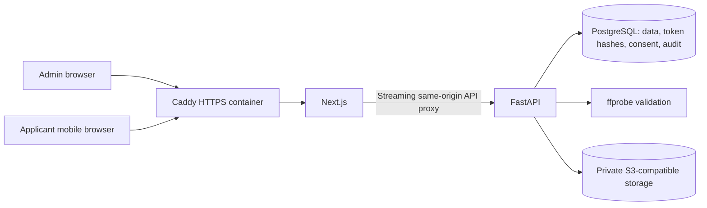

# Phase 1 architecture

## Scope

Phase 1 implements the complete human-reviewed video collection flow from
[instruction.txt](../instruction.txt). WhatsApp sharing remains manual. The pre-existing
appointment-monitoring interfaces remain dormant; no scheduler or notification runs.

Browsers never receive storage credentials or public video URLs. HTTPS terminates at
the Caddy container in production; local desktop development uses the localhost
secure-context exception. Only Caddy publishes ports 80/443 in production. Certificate,
database, and object volumes persist across container replacement. Recovery procedures
and the isolated deployment test are documented in [deployment.md](deployment.md).

## Modules and persistence

- `auth`: Argon2 admin accounts and opaque, revocable, eight-hour sessions.
- `processes`: typed validation, workflow services, applicant/admin API routes.
- `storage.py`: S3 adapter and private bucket initialization. Docker uses SeaweedFS;
  an external S3-compatible service can replace it through configuration.
- `audit`: immutable-through-the-API history. No raw tokens/passport values in logs.
- `frontend/app/api/[...path]`: streams requests/responses without loading complete
  videos into web-server memory; forwards only the headers needed by the API.
- `frontend/app/register`: mobile registration, consent, instructions, capture,
  preview, submission, invalid/expired/success states.
- `frontend/app/dashboard`: counts, searchable/paginated client list, creation,
  details, link replacement, protected playback/download, review, deletion, audit.

| Table | Responsibility |
| --- | --- |
| admin_users | Normalized unique email, password hash, active flag, timestamps |
| admin_sessions | Admin FK, unique token hash, expiry |
| client_processes | Applicant fields, workflow status, creation/update timestamps |
| registration_links | Process FK, token hash, 48-hour expiry, opened/used/revoked state |
| consent_records | Process FK, notice version, acceptance time, connection IP, browser |
| video_submissions | One recording per process, private object key, verified type/size/duration, deletion state |
| audit_logs | Actor, action, entity, timestamp; no unnecessary sensitive values |

Alembic migrations are explicit and checked against models. UUID keys, foreign keys,
unique token/object keys, and a unique video/process constraint protect associations.
PostgreSQL row locks serialize mutations on a process. No video bytes are in the database.

## Workflow and failure semantics

1. Admin creates a process; an invitation is returned once with a random 256-bit
   token and expiry exactly 48 hours later. Only the token hash persists.
2. The backend builds `/register/<token>` from validated `FRONTEND_PUBLIC_URL`,
   never request headers. The browser sends its bearer token to the API in a header.
   Legacy fragment links still work. Registration page requests contain the token;
   deployment access logs must omit/redact those paths. Referrers and caching are disabled.
3. Opening records the first open time. Registration validates all required fields.
4. Versioned consent is required before recording/upload. Once consent is accepted,
   applicant details cannot be silently overwritten through that link.
5. The browser records the front camera without audio, for 3–30 seconds, at a modest
   target resolution/bitrate. Preview and retake are local until confirmation.
6. The API rejects unsupported MIME types and oversized bodies before storage. Bytes
   stream to a temporary file capped at 30 MiB; ffprobe verifies container, codec,
   dimensions, and packet duration, including browser WebM without a duration header.
7. Authorization/expiry/consent are checked again at finalization under a process lock.
   The object is stored, metadata and audit committed, and the invitation consumed.
   Retry after successful submission returns an already-submitted state. Failed
   storage writes do not consume the invitation; exception cleanup removes partial objects.
8. Admin review/download/playback all require an active admin session. Range requests
   allow seeking without public presigned access. Access and actions are audited.
9. Deletion marks a durable `deleting` state before object removal, blocking playback.
   Success records `deleted_at`; failures remain retryable. Client data and consent
   are retained independently of video deletion.

Process states: created, link_generated, opened, registered, recording_started,
submitted, reviewed, deleted. `expired` is calculated from the latest valid invitation
for open processes, so dashboard/list results do not require a background expiry job.
Regeneration revokes all previous active invitations and preserves registration/consent.
Submitted/reviewed/deleted processes cannot be reopened with another link.

## API groups

| Group | Routes |
| --- | --- |
| Auth | POST login/logout, GET current admin |
| Admin processes | GET list/summary/detail, POST create/link/review |
| Admin video | GET protected stream/download, DELETE with durable retry state |
| Applicant | POST open/register/consent/recording/video with a scoped bearer token |
| Audit | GET recent administration activity and per-process history |
| Health | GET liveness/database readiness |

The FastAPI development OpenAPI page documents exact paths and request schemas.
The browser/server API clients use TypeScript response types. Client errors are
specific, server validation errors omit submitted values, and unexpected errors return
a generic message plus a request ID without leaking database parameters.

## Security and operations

All unsafe requests require an exact trusted Origin, including login and applicant
requests. Session cookies are host-only, HttpOnly, SameSite=Lax, and Secure in
production. Passwords use Argon2. Tokens/credentials are never placed in localStorage.
Registration tokens remain in the private invitation's path during the flow.
The public origin is configured once in the backend; the admin UI copies its returned
URL. Production requires HTTPS and an explicit origin allowlist containing that origin.

API/video responses have no-store caching and security headers. Structured request
logs use route templates, not actual tokens or request bodies. Admin authorization is
checked by the API regardless of which page initiated the request. SeaweedFS has no
published host ports and requires S3 authentication; a negative unauthenticated-object
test is included in the Docker browser check.

The demo uses one API worker and in-memory rate limiting (login: 5/minute, upload:
6/minute, default: 120/minute per observed connection IP). The proxy shares an IP in
local Docker. An internet deployment should put verified client-IP rate limiting at
the trusted edge; adding API replicas requires shared limiter storage. Connection IP
in the consent record is the observed peer by default. `FORWARDED_ALLOW_IPS` enables
Uvicorn proxy middleware only for explicitly trusted IPs/CIDRs; the Next.js API proxy
strips forwarded headers, so leave this empty in the default architecture.

Deployment configuration: HTTPS origin allowlist, Secure cookies, private networks,
HSTS at the edge, appropriate upload/time limits, and a production Next.js build.
Secrets are environment-only. Keep database and object-storage backups under the
operator's retention policy. A process crash between object upload and DB commit can
leave a private orphan; a future retention worker should reconcile unreferenced keys
after a safety delay. Manual deletion remains the Phase 1 retention mechanism.

The local demo targets 30–50 short recordings on 2 vCPU/4 GB RAM with 5–10 GB storage.
Paginated queries, metadata-only PostgreSQL storage, streaming video access, and the
S3 abstraction leave room for larger capacity without changing the applicant flow.

## Validation

API tests cover auth, consent/registration requirements, cross-process access,
expiration/regeneration, replay, search/pagination, upload limits, storage failure
retry, deletion failure retry, protected byte-range downloads, and migration parity.
The browser smoke test uses real MediaRecorder output, real ffprobe, PostgreSQL, and
private S3, covering the flow through retake, upload, review, download, and deletion.

Physical mobile camera/browser combinations require manual HTTPS testing; automated
Chromium synthetic-camera checks do not claim hardware or iOS coverage.

## References

- [SeaweedFS official project](https://github.com/seaweedfs/seaweedfs)
- [Next.js App Router](https://nextjs.org/docs/app/getting-started/installation)
- [FastAPI password hashing](https://fastapi.tiangolo.com/tutorial/security/oauth2-jwt/)
- [SQLAlchemy typed mappings](https://docs.sqlalchemy.org/en/20/orm/declarative_tables.html)
